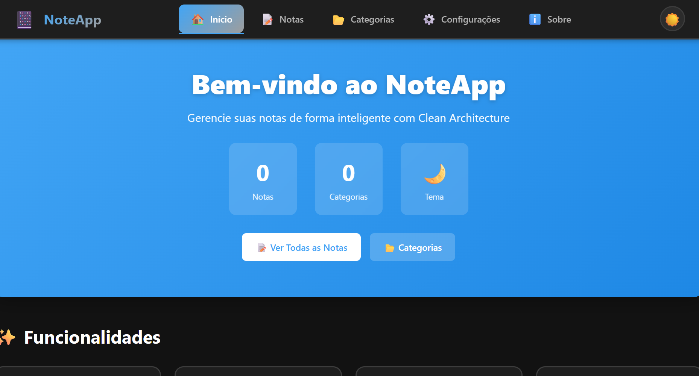
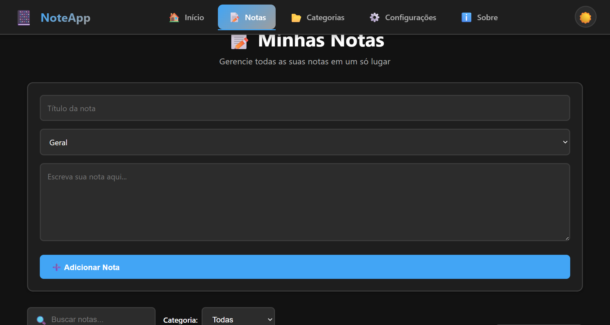
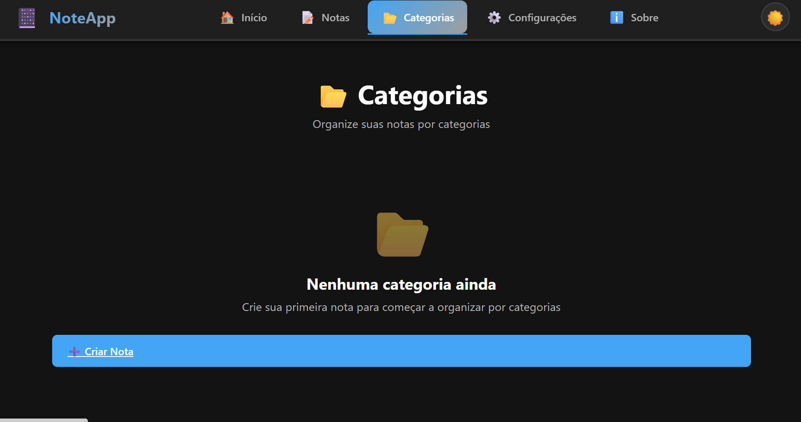
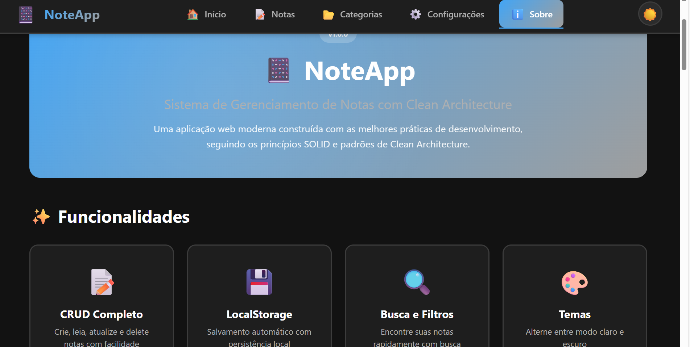

# 📸 Screenshots da Aplicação NoteApp

Esta pasta contém todas as capturas de tela da aplicação para documentação visual.

---

## 🖼️ Galeria de Imagens Disponíveis

### Páginas da Aplicação

#### 🏠 HomePage - Página Inicial


#### 📝 NotasPage - Gerenciamento de Notas


#### 📂 CategoriasPage - Visão por Categorias


#### ⚙️ ConfigPage - Configurações


#### ℹ️ SobrePage - Sobre a Aplicação


---

## 📋 Lista de Screenshots Necessários

### ✅ Páginas Principais

#### HomePage (Página Inicial)
- [ ] `homepage-light.png` - Tema claro
- [ ] `homepage-dark.png` - Tema escuro
- [ ] `homepage-hero.png` - Seção hero com estatísticas
- [ ] `homepage-features.png` - Grid de funcionalidades
- [ ] `homepage-recent.png` - Notas recentes

#### NotesPage (Gerenciamento de Notas)
- [ ] `notespage-list.png` - Lista completa de notas
- [ ] `notespage-edit.png` - Formulário em modo edição
- [ ] `notespage-create.png` - Formulário para nova nota
- [ ] `notespage-search.png` - Busca ativa com resultados
- [ ] `notespage-filters.png` - Filtros por categoria
- [ ] `notespage-sort.png` - Opções de ordenação
- [ ] `notespage-empty.png` - Estado vazio

#### CategoriesPage (Categorias)
- [ ] `categoriespage-overview.png` - Visão geral
- [ ] `categoriespage-distribution.png` - Gráfico de distribuição
- [ ] `categoriespage-cards.png` - Cards de categorias
- [ ] `categoriespage-empty.png` - Estado sem categorias

#### SettingsPage (Configurações)
- [ ] `settingspage-appearance.png` - Seção de aparência
- [ ] `settingspage-preferences.png` - Preferências
- [ ] `settingspage-data.png` - Gerenciamento de dados
- [ ] `settingspage-info.png` - Informações do sistema
- [ ] `settingspage-shortcuts.png` - Atalhos de teclado

#### AboutPage (Sobre)
- [ ] `aboutpage-hero.png` - Hero section
- [ ] `aboutpage-features.png` - Grid de funcionalidades
- [ ] `aboutpage-architecture.png` - Camadas da arquitetura
- [ ] `aboutpage-techstack.png` - Stack tecnológica
- [ ] `aboutpage-documentation.png` - Lista de documentação
- [ ] `aboutpage-solid.png` - Princípios SOLID
- [ ] `aboutpage-credits.png` - Créditos e links

---

### ✅ Componentes

#### Navigation
- [ ] `navigation-desktop.png` - Menu desktop
- [ ] `navigation-mobile-closed.png` - Menu mobile fechado
- [ ] `navigation-mobile-open.png` - Menu mobile aberto
- [ ] `navigation-active-link.png` - Link ativo destacado

#### NoteCard
- [ ] `notecard-default.png` - Card padrão
- [ ] `notecard-hover.png` - Estado hover
- [ ] `notecard-categories.png` - Diferentes categorias

#### NoteForm
- [ ] `noteform-empty.png` - Formulário vazio
- [ ] `noteform-filled.png` - Formulário preenchido
- [ ] `noteform-validation.png` - Validação de campos

#### SearchBar
- [ ] `searchbar-default.png` - Estado inicial
- [ ] `searchbar-typing.png` - Durante digitação
- [ ] `searchbar-filtered.png` - Com filtro aplicado

#### Modal
- [ ] `modal-info.png` - Modal informativo
- [ ] `modal-warning.png` - Modal de aviso
- [ ] `modal-danger.png` - Modal de perigo
- [ ] `modal-confirm.png` - Modal de confirmação

#### Toast
- [ ] `toast-success.png` - Notificação de sucesso
- [ ] `toast-error.png` - Notificação de erro
- [ ] `toast-warning.png` - Notificação de aviso
- [ ] `toast-info.png` - Notificação informativa
- [ ] `toast-multiple.png` - Múltiplas notificações

---

### ✅ Funcionalidades em Ação (GIFs)

- [ ] `theme-toggle.gif` - Alternância de tema
- [ ] `search-debounce.gif` - Busca com debounce
- [ ] `note-crud.gif` - Criar, editar e deletar nota
- [ ] `category-filter.gif` - Filtragem por categoria
- [ ] `sort-animation.gif` - Ordenação de notas
- [ ] `modal-interaction.gif` - Interação com modal
- [ ] `toast-animation.gif` - Animação de toast
- [ ] `navigation-mobile.gif` - Menu mobile em ação
- [ ] `export-data.gif` - Exportação de dados
- [ ] `responsive-demo.gif` - Demonstração responsiva

---

### ✅ Responsividade

#### Desktop (1920x1080)
- [ ] `desktop-homepage.png`
- [ ] `desktop-notespage.png`
- [ ] `desktop-fullwidth.png`

#### Tablet (768x1024)
- [ ] `tablet-portrait.png`
- [ ] `tablet-landscape.png`
- [ ] `tablet-navigation.png`

#### Mobile (375x667)
- [ ] `mobile-homepage.png`
- [ ] `mobile-notespage.png`
- [ ] `mobile-menu.png`
- [ ] `mobile-form.png`

---

### ✅ Temas

#### Light Theme (Tema Claro)
- [ ] `light-homepage.png`
- [ ] `light-notespage.png`
- [ ] `light-categoriespage.png`
- [ ] `light-settingspage.png`
- [ ] `light-aboutpage.png`

#### Dark Theme (Tema Escuro)
- [ ] `dark-homepage.png`
- [ ] `dark-notespage.png`
- [ ] `dark-categoriespage.png`
- [ ] `dark-settingspage.png`
- [ ] `dark-aboutpage.png`

---

## 📐 Especificações Técnicas

### Resolução Recomendada
- **Desktop Screenshots:** 1920x1080px ou 1280x720px
- **Tablet Screenshots:** 768x1024px
- **Mobile Screenshots:** 375x667px (iPhone 8) ou 414x896px (iPhone 11)

### Formato de Arquivo
- **Imagens estáticas:** PNG (melhor qualidade)
- **Animações:** GIF ou MP4
- **Tamanho máximo:** 2MB por imagem

### Ferramentas Recomendadas

#### Para Capturar Screenshots
- **Windows:** Snipping Tool, Greenshot, ShareX
- **Mac:** Cmd+Shift+4
- **Browser:** DevTools (F12) para diferentes resoluções

#### Para Criar GIFs
- **ScreenToGif** (Windows)
- **LICEcap** (Windows/Mac)
- **Peek** (Linux)
- **Kap** (Mac)

#### Para Otimizar Imagens
- **TinyPNG** - https://tinypng.com/
- **Squoosh** - https://squoosh.app/
- **ImageOptim** (Mac)

---

## 📝 Como Capturar Screenshots

### 1. Prepare o Ambiente
```bash
# Inicie o projeto
cd NoteApp
npm run dev

# Acesse no browser
http://localhost:5173
```

### 2. Configure o Browser
- Use modo incógnito/privado para tela limpa
- Desative extensões para evitar interferências
- Ajuste zoom para 100%
- Limpe cache de notas antigas se necessário

### 3. Popule com Dados de Exemplo
Crie notas variadas para screenshots mais realistas:
- Notas em diferentes categorias
- Títulos e conteúdos diversos
- Mix de notas recentes e antigas

### 4. Capture Screenshots Sistemáticamente
- Navegue por todas as páginas
- Capture estados diferentes (vazio, populado, hover, etc)
- Tire screenshots em ambos os temas (claro/escuro)
- Teste e capture responsividade

### 5. Organize e Nomeie
- Salve com nomes descritivos
- Mantenha estrutura consistente
- Adicione prefixos (homepage-, notespage-, etc)

---

## ✅ Checklist de Qualidade

Antes de finalizar, verifique:
- [ ] Screenshots nítidos e bem enquadrados
- [ ] Resolução adequada para cada dispositivo
- [ ] Ambos os temas (claro e escuro) cobertos
- [ ] Textos legíveis
- [ ] Sem informações sensíveis visíveis
- [ ] Nomes de arquivo consistentes
- [ ] Imagens otimizadas (tamanho < 2MB)
- [ ] GIFs fluidos e com taxa de frames adequada

---

## 🎨 Dicas para Screenshots Profissionais

1. **Consistência Visual**
   - Use os mesmos dados de exemplo em screenshots relacionados
   - Mantenha configurações de tema consistentes
   - Capture na mesma resolução quando comparando

2. **Conte uma História**
   - Mostre fluxo de trabalho completo
   - Demonstre antes/depois de ações
   - Destaque funcionalidades importantes

3. **Destaque Features**
   - Use setas ou anotações quando necessário
   - Destaque áreas importantes
   - Mostre interações complexas em GIFs

4. **Qualidade sobre Quantidade**
   - Priorize screenshots que agregam valor
   - Evite duplicatas desnecessárias
   - Foque em funcionalidades únicas

---

**Última atualização:** 27 de Novembro de 2025
